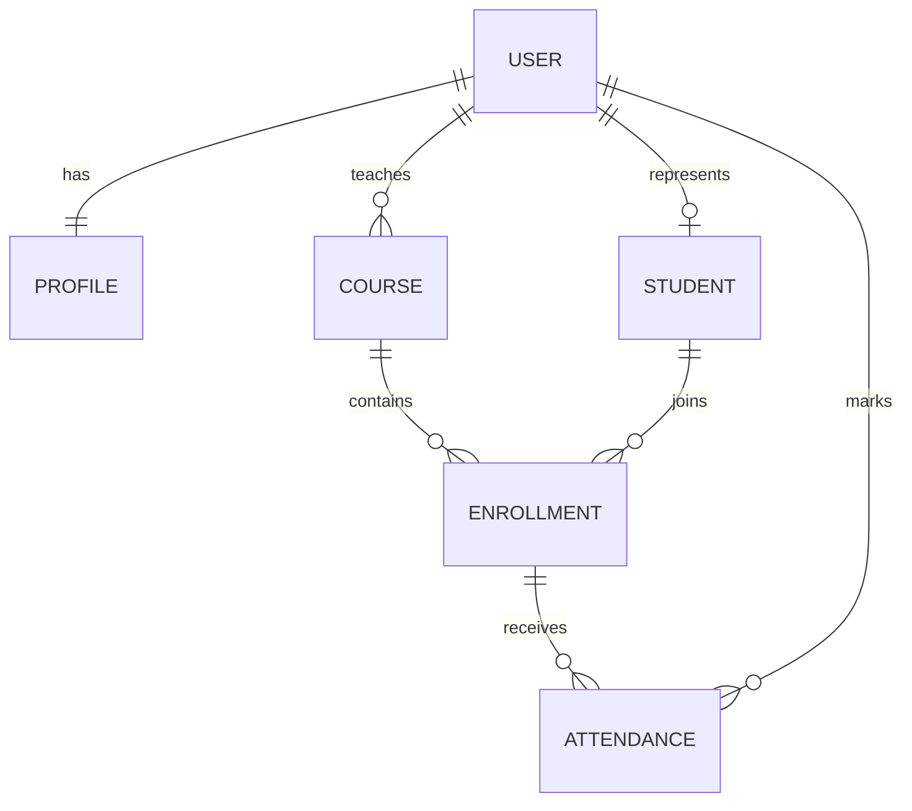

# Course and Attendance Management REST API

A complete backend portfolio project built with **Python**, **Django**, **Django REST Framework**, and **JWT authentication**. The application manages students, courses, enrolments, and daily attendance with separate permissions for administrators, instructors, and students.

> I developed a Course and Attendance Management REST API using Django and Django REST Framework. The system manages courses, students, enrolments and daily attendance. I used Django ORM relationships, JWT authentication, role-based permissions and serializer validation. I also wrote API tests for authentication, attendance creation and duplicate-record prevention. I managed development through Git feature branches and tested the endpoints using Postman.

## Project Preview

After starting the server, open:

- Portfolio homepage: `http://127.0.0.1:8000/`
- Swagger UI: `http://127.0.0.1:8000/api/docs/`
- ReDoc: `http://127.0.0.1:8000/api/redoc/`
- Health check: `http://127.0.0.1:8000/api/health/`
- Django admin: `http://127.0.0.1:8000/admin/`

The homepage confirms that the project is running and provides direct links to the API documentation and admin panel.

## Main Features

- JWT access, refresh, and verification endpoints
- Admin, instructor, and student roles
- Public student registration endpoint
- Course ownership and object-level authorization
- Student enrolment management
- Daily attendance with present, absent, late, and excused statuses
- Duplicate enrolment and duplicate attendance prevention
- Validation for inactive enrolments and future attendance dates
- Role-filtered querysets to prevent unauthorized data access
- Search, ordering, filtering, and pagination
- Swagger UI and ReDoc OpenAPI documentation
- Offline Swagger/ReDoc assets through drf-spectacular-sidecar
- Automated API tests
- GitHub Actions continuous integration
- Postman collection with reusable variables
- Demo seed command
- Docker support
- Professional portfolio homepage and health endpoint

## Technology Stack

- Python 3.10 or newer; Python 3.13 recommended
- Django 5.2 LTS
- Django REST Framework 3.16
- Simple JWT
- drf-spectacular and drf-spectacular-sidecar
- SQLite for the local portfolio version
- GitHub Actions
- Docker and Docker Compose
- Postman

## Role Permissions

| Action | Admin | Instructor | Student |
|---|---:|---:|---:|
| View courses | All | All | All |
| Create courses | Yes | Yes, assigned to self | No |
| Update/delete courses | All | Own courses | No |
| View students | All | Students in own courses | Own profile |
| Manage enrolments | All | Own courses | No |
| View attendance | All | Own courses | Own records |
| Create/update attendance | All | Own courses | No |

## Data Model



### Why attendance references an enrolment

Attendance belongs to a valid student-course relationship. Connecting attendance to `Enrollment` prevents attendance from being created for a student who is not enrolled in that course.

## Fastest Local Setup on macOS or Linux

The setup script automatically finds Python 3.10–3.13, creates the virtual environment, installs packages, runs migrations, creates demo data, checks the project, and runs the tests.

```bash
unzip course-attendance-management-api.zip
cd course-attendance-management-api
chmod +x setup.sh run.sh verify.sh
./setup.sh
./run.sh
```

Open:

```text
http://127.0.0.1:8000/
```

Stop the server with `Control + C`.

## Manual Local Setup

Use Python 3.10 or newer. On macOS, explicitly using Python 3.13 avoids accidentally creating the environment with the older system Python.

```bash
cd course-attendance-management-api

python3.13 -m venv .venv
source .venv/bin/activate

python -m pip install --upgrade pip
python -m pip install -r requirements.txt

cp .env.example .env
python manage.py migrate
python manage.py seed_demo
python manage.py check
python manage.py test
python manage.py runserver
```

When `python3.13` is unavailable on macOS:

```bash
brew install python@3.13
"$(brew --prefix python@3.13)/bin/python3.13" -m venv .venv
source .venv/bin/activate
```

## Demo Accounts

Run `python manage.py seed_demo`, then use:

| Role | Username | Password |
|---|---|---|
| Admin | `admin` | `AdminPass123` |
| Instructor | `instructor` | `InstructorPass123` |
| Student | `student` | `StudentPass123` |

These credentials are for local demonstration only. Do not use them in production.

## Main API Endpoints

| Method | Endpoint | Purpose | Access |
|---|---|---|---|
| GET | `/` | Portfolio homepage | Public |
| GET | `/api/health/` | Service health check | Public |
| POST | `/api/auth/register/` | Register a student | Public |
| POST | `/api/auth/token/` | Obtain access and refresh tokens | Public |
| POST | `/api/auth/token/refresh/` | Refresh an access token | Public |
| POST | `/api/auth/token/verify/` | Verify an access token | Public |
| GET | `/api/auth/me/` | View authenticated account | Authenticated |
| GET/POST | `/api/students/` | List or create student profiles | Role-based |
| GET/POST | `/api/courses/` | List or create courses | Role-based |
| GET/POST | `/api/enrollments/` | List or create enrolments | Role-based |
| GET/POST | `/api/attendance/` | List or create attendance | Role-based |
| GET | `/api/schema/` | OpenAPI schema | Public |
| GET | `/api/docs/` | Swagger UI | Public |
| GET | `/api/redoc/` | ReDoc documentation | Public |

Protected requests use:

```http
Authorization: Bearer YOUR_ACCESS_TOKEN
```

## Example: Obtain a JWT Token

```bash
curl -X POST http://127.0.0.1:8000/api/auth/token/ \
  -H "Content-Type: application/json" \
  -d '{"username":"instructor","password":"InstructorPass123"}'
```

Copy the returned `access` value.

## Example: List Courses

```bash
curl http://127.0.0.1:8000/api/courses/ \
  -H "Authorization: Bearer YOUR_ACCESS_TOKEN"
```

## Example: Mark Attendance

```bash
TODAY=$(date +%F)

curl -X POST http://127.0.0.1:8000/api/attendance/ \
  -H "Authorization: Bearer YOUR_ACCESS_TOKEN" \
  -H "Content-Type: application/json" \
  -d "{
    \"enrollment_id\": 1,
    \"date\": \"$TODAY\",
    \"status\": \"present\",
    \"remarks\": \"Completed the practical exercise.\"
  }"
```

Submitting the same enrolment and date again returns a validation error because the project permits only one daily attendance record per enrolment.

## Search and Filters

```text
/api/courses/?search=django&active=true
/api/courses/?ordering=code
/api/enrollments/?course=1&active=true
/api/enrollments/?student=1
/api/attendance/?course=1&student=1
/api/attendance/?date=2026-07-31&status=present
/api/attendance/?ordering=-date
```

## Automated Tests

Run:

```bash
python manage.py test
# or run the complete verification suite
./verify.sh
```

The test suite covers:

- Public homepage and health endpoint
- Protected endpoint authentication
- Student registration
- Duplicate username, email, and registration-number validation
- JWT login and authenticated-user endpoint
- Instructor course creation
- Instructor course-ownership restrictions
- Admin course validation
- Duplicate enrolment prevention
- Attendance creation
- Duplicate attendance prevention
- Future-date validation
- Cross-instructor attendance restrictions
- Student write restrictions
- Student access to only their own attendance

## Postman

Import:

```text
postman/Course_Attendance_API.postman_collection.json
```

Recommended demonstration flow:

1. Run `python manage.py seed_demo`.
2. Run the **Public** requests to confirm the service and schema.
3. Send **Instructor Login**; its test script saves the JWT tokens.
4. Run **List Enrolments** to save the demo student and enrolment IDs.
5. Run **Create Course as Instructor**, followed by **Create Enrolment for New Course**.
6. Run **Mark Attendance**, then repeat it with **Duplicate Attendance Validation**.
7. Log in with the student credentials to demonstrate read-only role restrictions.

The collection generates attendance dates using the computer's local date rather than UTC, avoiding date mismatches in time zones such as Asia/Karachi.

## Docker Setup

```bash
cp .env.example .env
docker compose up --build
```

In another terminal:

```bash
docker compose exec api python manage.py seed_demo
```

Then open `http://127.0.0.1:8000/`.

## GitHub Actions

The workflow runs on pushes and pull requests to `main` and `develop`. It performs:

```text
Dependency installation
Django system check
Migration consistency check
Automated API tests
```

## Project Structure

```text
course-attendance-management-api/
├── accounts/                  # Profiles, registration and account endpoints
├── academics/                 # Courses, students, enrolments and attendance
├── config/                    # Django settings, URLs and project views
├── templates/                 # Portfolio homepage
├── postman/                   # Postman collection
├── .github/workflows/         # GitHub Actions CI
├── manage.py
├── requirements.txt
├── setup.sh                   # Automatic local setup
├── run.sh                     # Start local server
├── verify.sh                  # Run checks, tests and schema validation
├── Dockerfile
├── docker-compose.yml
├── GITHUB_SETUP.md
└── INTERVIEW_NOTES.md
```

## Publish to GitHub

Create an empty public GitHub repository named `course-attendance-management-api`, then run:

```bash
git init
git branch -M main
git add .
git commit -m "feat: build course and attendance management REST API"
git remote add origin https://github.com/Nurooz-Amin/course-attendance-management-api.git
git push -u origin main
```

See `GITHUB_SETUP.md` for the complete publishing and interview-demonstration guide.

## Suggested Git Feature Branches

For future improvements, use branches such as:

```text
feature/authentication
feature/course-management
feature/enrollment-management
feature/attendance-validation
test/api-permissions
docs/project-readme
```

Example workflow:

```bash
git checkout -b feature/attendance-reports
# make changes
git add .
git commit -m "feat: add attendance summary endpoint"
git push -u origin feature/attendance-reports
```

## Interview Talking Points

1. **Django ORM relationships:** `ForeignKey` and `OneToOneField` model the user, course, student, enrolment, and attendance relationships.
2. **Authentication versus authorization:** JWT verifies identity, while permission classes and filtered querysets control access.
3. **Data integrity:** Serializer validation gives readable API errors, while database constraints provide final protection.
4. **Object ownership:** Instructors can modify only their own courses and associated records.
5. **Query optimization:** `select_related()` and `annotate()` reduce unnecessary database queries.
6. **Quality assurance:** Automated tests and GitHub Actions verify the main workflows.
7. **API documentation:** OpenAPI, Swagger UI, ReDoc, curl examples, and Postman make the project easy to review.

## Troubleshooting

### `Page not found (404)` at `/`

This corrected version includes a homepage at `/`. Restart the server after replacing the old project folder:

```bash
source .venv/bin/activate
python manage.py runserver
```

### `No module named django`

The virtual environment is missing packages or was created with an unsupported Python version. Use:

```bash
rm -rf .venv
./setup.sh
```

### Python 3.9 error while installing Django

Install and explicitly use Python 3.13:

```bash
brew install python@3.13
rm -rf .venv
"$(brew --prefix python@3.13)/bin/python3.13" -m venv .venv
source .venv/bin/activate
python -m pip install -r requirements.txt
```

### Port 8000 is already in use

```bash
python manage.py runserver 8001
```

Then open `http://127.0.0.1:8001/`.

## Future Improvements

- PostgreSQL production configuration
- Bulk attendance-marking endpoint
- Attendance percentage reports
- CSV and PDF exports
- Semester and timetable models
- Email notifications for low attendance
- Redis caching and Celery background jobs
- Deployment using Gunicorn and a cloud platform

## Author

**Nurooz Amin**  
Python / Django Backend Developer
